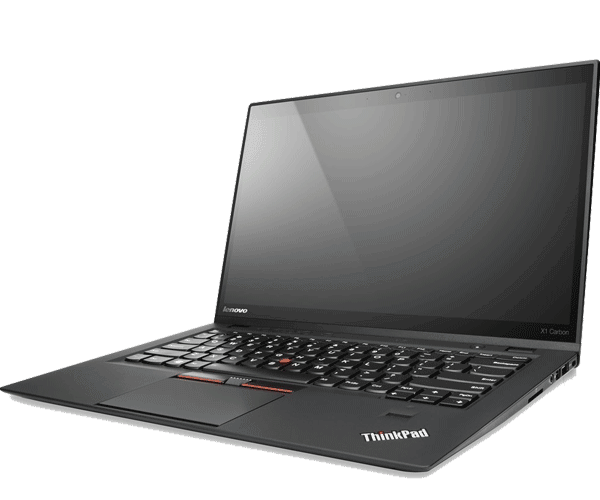

# Charge Control for Lenovo Laptops
maintained by: @hkdb



## SUMMARY

My own customized shortcut way to set my Lenovo laptops between two sets of charge thresholds:

- Plugged in at home or office - start: 70 | end: 80
- Prepare to get on the road - start: 0 | end: 100

This was tested on Lenovo's 6th Gen X1 Carbon running Garuda Linux.


## INSTALLATION


```
sudo pacman -S acpi_call-dkms tpacpi-bat
git clone https://github.com/hkdb/lenovocc.git
cd lenovocc
./install.sh
```

Make sure you exit out of the shell and start a new one before using so that the at launch check for ~/.local/bin gets registered to `$PATH`.

To uninstall, simply run the following in the terminal inside the repo:

```
./uninstall.sh
```

## USAGE

To set charge thresholds to start at 70 and stop at 80, execute the following in the terminal:

```
deskmode
```

To set charge thresholds to start at 0 and stop at 100, execute the following in the terminal:

```
roadmode
```

To double check on your current settings, execute the following in the terminal:
```
checkcc
```

## CHANGE

- 05032021 - added checkcc
- 05032021 - first commit


## DISCLAIMER

This is made available to anyone that would like to use it but nothing in this repo comes with a warranty. I will not be responsible for anything in hear cause any type of damage. Please use at your own risk.
